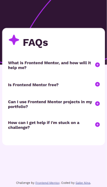

# Frontend Mentor - FAQ accordion solution

This is a solution to the [FAQ accordion challenge on Frontend Mentor](https://www.frontendmentor.io/challenges/faq-accordion-wyfFdeBwBz). Frontend Mentor challenges help you improve your coding skills by building realistic projects. 

## Table of contents

- [Overview](#overview)
  - [The challenge](#the-challenge)
  - [Screenshots](#screenshots)
  - [Links](#links)
- [My process](#my-process)
  - [Built with](#built-with)
  - [Code from the Design](#code-from-the-design)
- [Author](#author)

## Overview

### The challenge

Users should be able to:

- Hide/Show the answer to a question when the question is clicked
- Navigate the questions and hide/show answers using keyboard navigation alone
- View the optimal layout for the interface depending on their device's screen size
- See hover and focus states for all interactive elements on the page

### Screenshots

#### Desktop


#### Mobile


### Links

- Live Site URL: [Add live site URL here](https://crazy-candyman.github.io/FAQs-Accordion/)

## About the Design

- I designed this code by generating the html with javscript in a loop so that
  it can populate the questions and answers accordingly.
- This is designed so that all you need to do is add more objects to the 'faqsObject'
  file and it will self generate the HTML and CSS.

### Built with

- Semantic HTML5 markup
- CSS custom properties
- CSS Grid
- @ Media Query
- Mobile-first workflow
- Javascript
- Imported Modules

### Code from the Design

#### Using Objects to generate HTML

```js
export const faqsObjects = [{
  question: 'What is Frontend Mentor, and how will it help me?',
  btnImage: '/assets/images/icon-plus.svg',
  answer: `We provide front-end challenges that include professional web designs.
  These allow you to practice building websites in a realistic workflow.
  Taking these challenges will help you improve your skills, gain
  experience creating websites, and build up an incredible project
  portfolio. We also have a large community of developers, so it's a
  great way to meet other devs!`
}, {
  question: 'Is Frontend Mentor free?',
  btnImage: '/assets/images/icon-plus.svg',
  answer: `The majority of our challenges are free, yes. We do have some that are premium
  and require a Pro subscription to access. It will say on each challenge whether
  they are free or premium, so it's easy to tell the difference.`
}, {
  question: 'Can I use Frontend Mentor projects in my portfolio?',
  btnImage: '/assets/images/icon-plus.svg',
  answer: `Definitely! Please do feel free to use whatever you build in your portfolio.
  Helping developers add professional-looking projects to their portfolio was one
  of the reasons we created this platform!`
}];
```

#### Generating HTML using Javascript
```js
import { faqsObjects } from "./faqs.mjs";

export function generateQuestions() {
  faqsObjects.forEach((faq)=> {
    document.querySelector("section").innerHTML += `
        <article>
          <h2>${faq.question}</h2>
          <button>
            
          </button>
          <p></p>
        </article>
         `
  })
}
```

## Author

- Linkedin - [Gabriel Nina](www.linkedin.com/in/gabrielnina)
- Frontend Mentor - [@Crazy-Candyman](https://www.frontendmentor.io/profile/Crazy-Candyman)

